# Health Insurance Cross Sell
Neste repositório estará contido o processo de um projeto de machine learning para previsão da propensão de venda de seguros de carros para uma 
seguradora que já possui uma base de clientes de seguro de saúde.

# 1.0 Business problem
## 1.1 Problem
Esta empresa de seguros já possui uma carteira de clientes e deseja prever quais clientes desta carteira estariam interessados em adquirir um seguro de carro. Com recursos limitados, a empresa irá entrar em contato com os potenciais clientes para oferecer este novo produto de forma assim a otimizar a conversão. Este é um projeto de learning to rank (LTR).

## 1.2 Assumptions
De forma a promover melhor o produto, a empresa ira contactar somente 40% da base dos clientes, sendo assim ela necessita de uma lista ordenada de clientes com maior propensão de adquirir o seguro de carro.

# 2.0 Solution strategy
## 2.1 Final product
* Será entregue uma planilha no Google Sheets com uma função que irá calcular qual seria a propensão de compra de cada cliente fornecido nessa planilha
## 2.2 Tools
* Python
* Github
* Pandas 
* Scikit-learn
* XGBoost
* LightGBM
* Flask
* Google Sheets Apps Script

## 2.3 Solution process
Como metodologia, será utilizada o CRISP-DM, sendo detalhado da seguinte forma:

### Step 01: Data description
* Coletar dados (fornecidos em um arquivo .csv)
* Entender a representação de cada coluna e renomear
* Identificar dimensão e tipo dos dados
* Identificar e tratar dados nulos
* Analisar estatística descritiva dos dados
* Dividir o dataset em treino e teste

### Step 02: Feature engineering
* Criar mindmap de hipóteses
* Criar novas features para validação das hipóteses

### Step 03: Data filtering
* Filtrar dados de acordo com possíveis restrições do negócio

### Step 04: EDA - Exploratory Data Analysis
* Análise univariada, identificar as especificidades de cada atributo
* Análise bivariada, validar as hipóteses criadas e gerar insights

### Step 05: Data preparation
* StandardScaler para features com distribuição normal
* MinMaxScaler para features com distribuição não normal
* Target encoder and frequency encoder para features categóricas
* Transformações aplicadas no dataset de teste
### Step 06: Feature selection
* Separação do dataset entre treino e validação
* Uso do ExtraTrees como seleção de features, selecionando as com maior importância no modelo

### Step 07: Machine learning modelling
* Rodar os algoritimos de classificação KNN, LogisticRegression, ExtraTrees, XGBoost, LGBM
* Avaliar os modelos conforme Accuracy, Precision, Recall, Precision@K e Recall@K
* Plotar as curvas de Gain e Lift de cada modelo
* Realizar CrossValidation em cada modelo e analisar métricas

    Baseado nas métricas avaliadas, escolhemos o **LGBM** para seguir como modelo principal no decorrer do projeto

### Step 08: Hyperparameter Fine Tunning
* Utilizamos a técnica de RandomSearch para encontrar os melhores parâmetros do modelo
* Com estes parâmetros definidos, avaliamos o modelo novamente com as métricas vistas anteriormente (Precision, Recall, Precision@K, Recall@K)
* Plot das curvas de Gain e Lift do modelo com relação ao baseline

### Step 09: Business performance
* Convertendo o modelo em performance de mercado, temos que ao contactar 40% da base de novos clientes, teremos uma conversão estimada de 90%
* Ao realizar 20.000 ligações podemos ter uma receita estimada de $203.89M, em comparação com a mesma quantidade de ligações utilizando-se de uma lista aleatória, teriamos uma receita estimada de $74.99M (temos um modelo 2,71 vezes melhor)
* Estimou-se que seriam necessárias 23.500 ligações para alcançar 80% dos clientes mais interessados

### Step 10: Deploy
* Desenvolvemos uma API que ao informar uma base de clientes, realizará todo o processamento dos dados e modelagem, retornando assim um valor (score) de propensão para cada cliente da lista
* Posteriormente esta API será integrada a uma planilha do Google Sheets

# 3.0 Insights
Durante a EDA analisamos algumas hipóteses e podemos tirar alguns insights sobre o negócio, temos 3 exemplos a seguir:

## Clientes com carros mais velhos tem maior propensão de adquirir um seguro
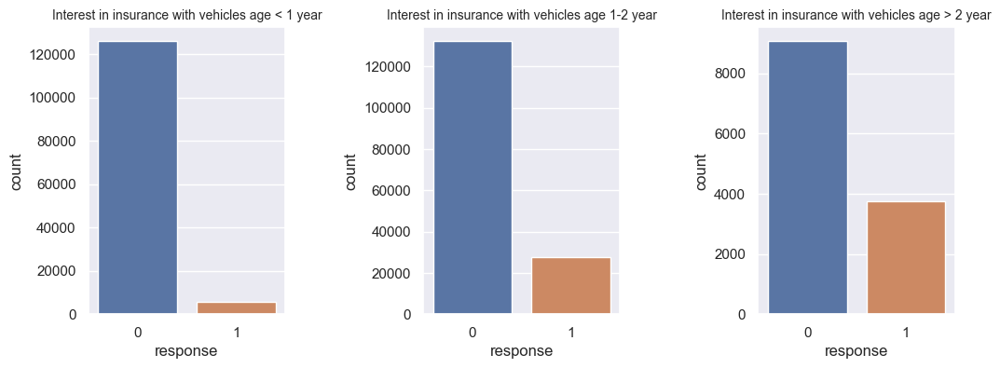

## Clientes entre 40-50 anos tem maior propensão de adquirir um seguro
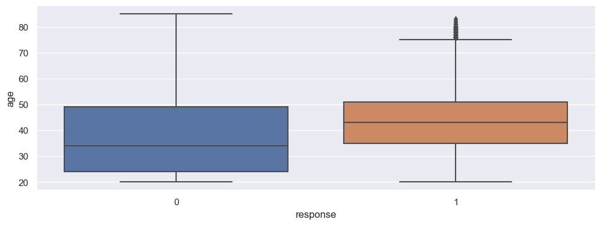
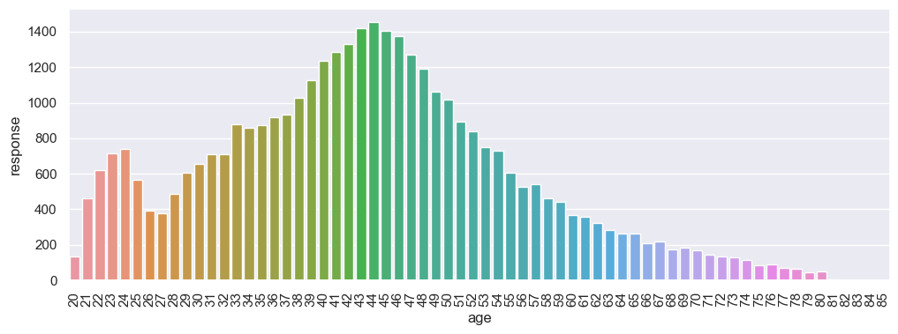

## Clientes que já tiveram seu carro acidentado tem maior propensão de adquirir um seguro
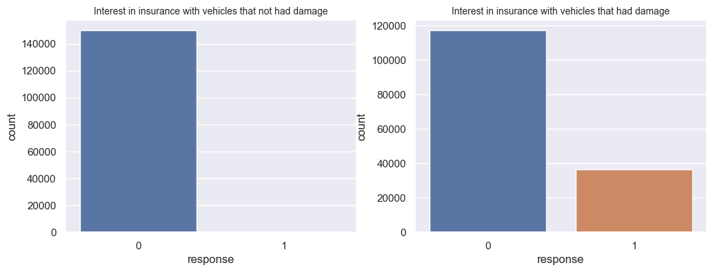

# 4.0 Machine Learning model performance
Para selecionar o melhor modelo, avaliamos cada modelo testado com sua curva de Gain e Lift, sendo apresentadas abaixo
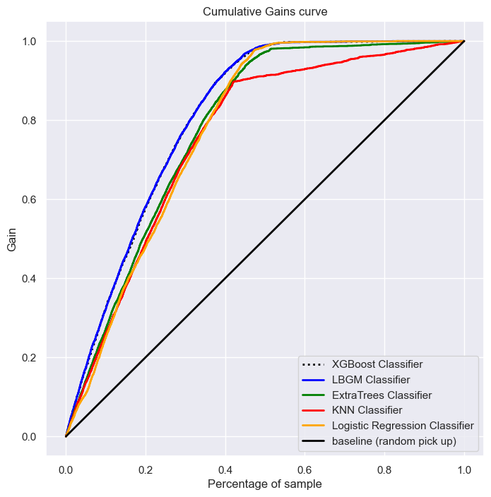
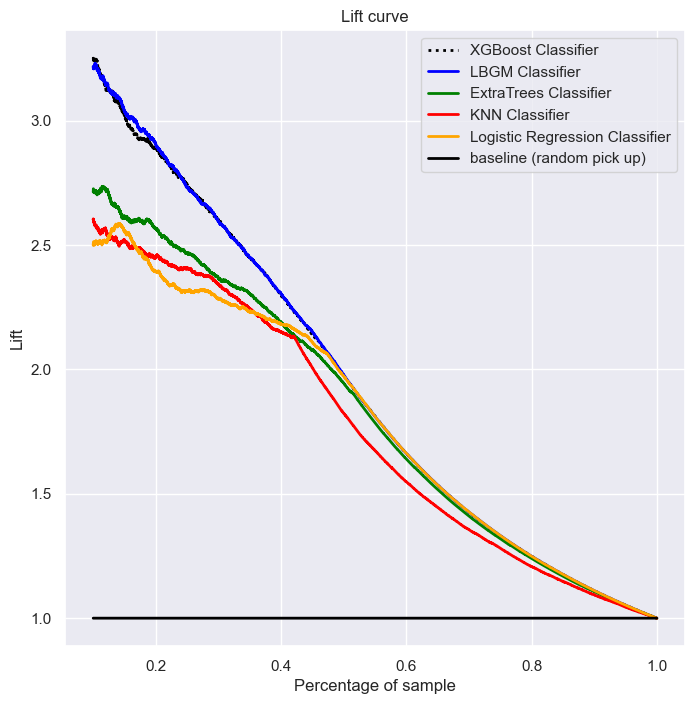

Podemos ver que a curva azul (LGBM) se aproxima mais de um modelo perfeito.

Analisamos também algumas métricas de cada modelo  
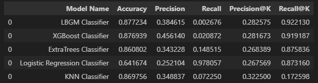

Sendo assim, concluímos que o LGBM foi o modelo com melhor performance e utilizamos ele para o deploy do projeto.
# 5.0 Business performance
Com o modelo escolhido, podemos analisar a performance do modelo aplicado no negócio, conforme estipulado inicialmente somente seria possível contactar 40% da base de novos clientes, desta forma o modelo estima uma conversão de 92% e sendo 2,31 vezes melhor do que uma lista aleatória de clientes.

Estimamos também como o modelo performaria com 20.000 e 40.000 ligações:  
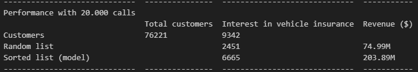
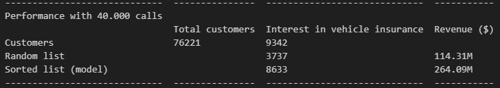

Identificamos também, quantas ligações seriam necessárias para atingir 80% da base de clientes interessados (estimouse 23.500 ligações)  
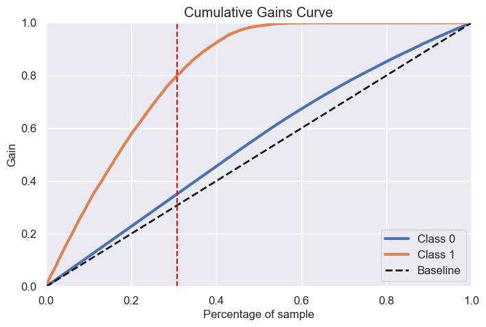
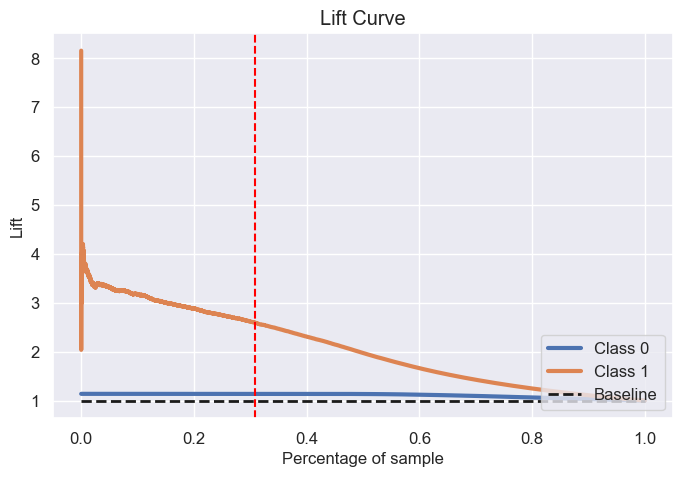

# 6.0 Conclusions
Com base nos resultados e performance do modelo apresentada, podemos concluir que o projeto teve êxito em seu objetivo de definir uma lista ordenada de clientes com maiores probabilidades de adquirir um seguro de carro, o que aplicando este modelo no negócio pode dobrar a produtividade do setor de vendas.

# 7.0 Next steps
* Definir possíveis novas features para o negócio de forma a otimizar um novo modelo
* Utilizar outros métodos para seleção de features 
* Testar diferentes métodos para a tunagem de hiperparametros
